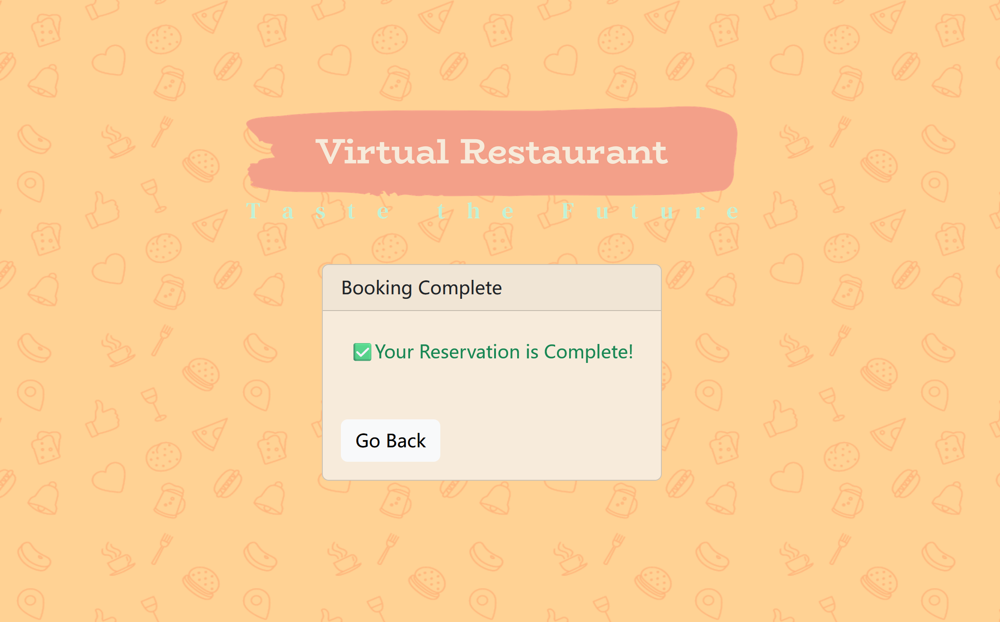
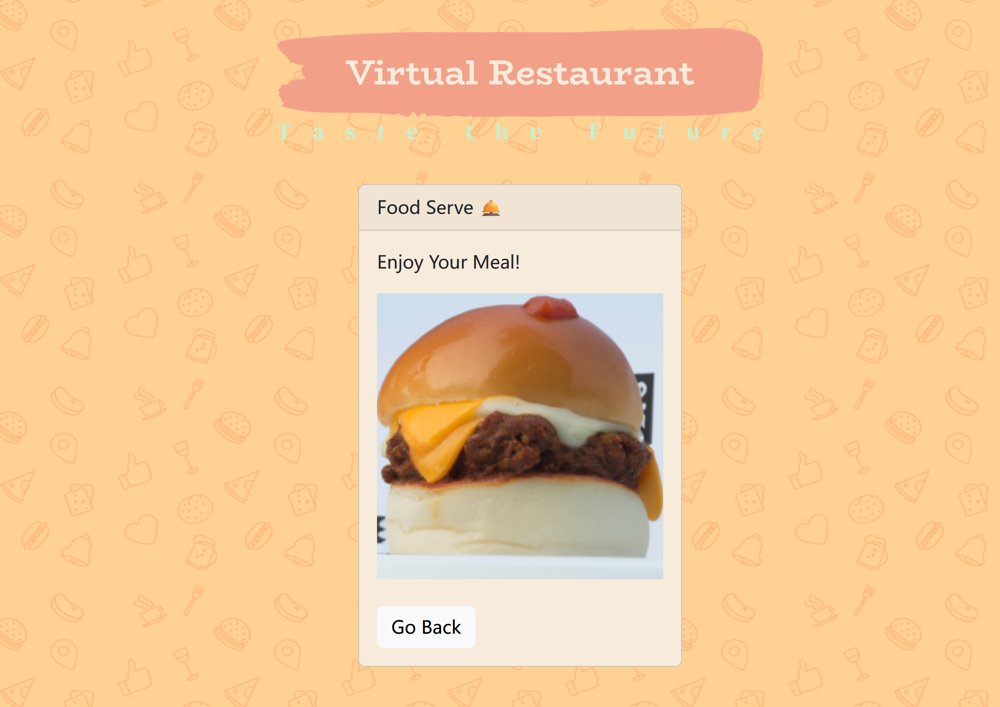

# Virtual Restaurant

[![MIT License][license-shield]][license-url] * [![React][React.js]][React-url]

[license-shield]: https://img.shields.io/github/license/lynnx7/Virtual-Restaurant.svg?style=for-the-badge
[license-url]: https://github.com/lynnx7/Virtual-Restaurant/blob/master/LICENSE.txt
[React.js]: https://img.shields.io/badge/React-20232A?style=for-the-badge&logo=react&logoColor=61DAFB
[React-url]: https://reactjs.org/

Welcome! This is my personal side project: a web application like online foor ordering system, where you could make reservation or browse various food - but the ordered food is presented as AI-generated Image rather than real food.

Tech & Library used:

 1. React.JS
 2. React-Bootstrap
 3. React-DatePicker

Appearance:

 1. Logo Design:  [LOGO](https://app.logo.com)
 2. Asset Image: [Unsplash](https://unsplash.com/)
 4. Color Palette: [California Citrus](https://www.canva.com/colors/color-palettes/california-citrus/) by Canva
 5. Background Pattern Design: [Patternico](https://patternico.com)

# A Niche Tour

Virtual Restaurant isn't complicated but I would like to guide you through - there is a full tutorial on reproduce the web on your computer at the end, but if you just want a quick look please start here:

## Menu (Thumbnail)

This is the first page when you enter the website, you could choose to book a seat in advance by clicking **Book Now,** or direct order food by clicking **Order Now**.

## Book - step one

There are lists of restaurants - select one that fit you best. Then a form will come out asking for your details. Complete them and click **Next**

## Book - step two

You will see a window asking you to check again your entered details. Click **Submit** if everything is right, or click **Go Back**

## Book - step three

You will see the confirmation window, which mean your book is successful! Click **Go Back** to return to the front page

##  Order - step one

There are a range of food you might want to order, click category on the left, then the relevant item will displayed on the right. You could search the item on the search bar located on the right top.

To add an item, you could type in the quantity in "Qty" column, or manually click "+". Then click Add to add this item in the chart. You could modify this in the shopping cart if you change your mind. Click **Check-Out** when you selection is done.

## Order - step two

You could see your order summary, including the total cost. Now it is time to pay for the bill - Don't worry, for this demo showcase we could use the Skip option. I implement the format testing to simulate the real scenario (e.g. your CVV can't exceed 3 digits). You could type anything and click **submit**

## Order - step three

Now the food will "coming", wait a second and you will see the images of your order. Click **go back** to return to the front page.

# Install Virtual Restaurant

## Preparation

 1. You need to install Node.JS [Here](https://nodejs.org/en)
 2. You need to install React.JS
 `npm install -g create-react-app`
 3. Extra Library is also required
 `npm install react-bootstrap bootstrap`
 `npm install react-datepicker --save`

## Run

Clone or download this repo, then open with any IDE you prefer. Open the terminal window and then run `npm start`, the app will browse in your explorer.

**In order to use AI-image generation, you need to fill your OpenAI-API key in .env file. This is optional if you don't wanna use the image generation feature.

# Declaration
I have build this project completely by myself, commercial use is not permitted.
